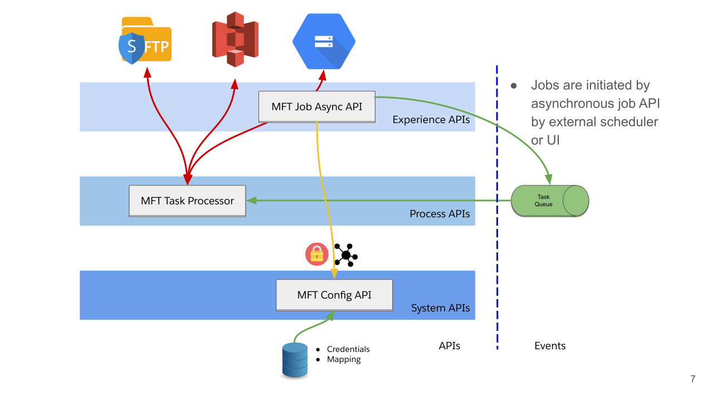
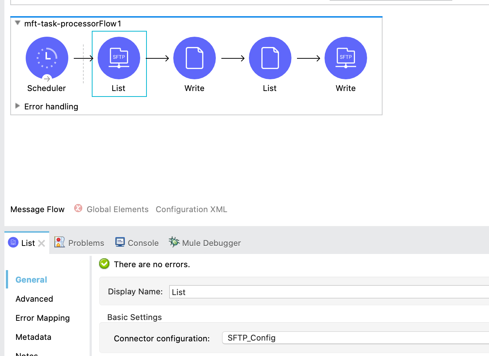
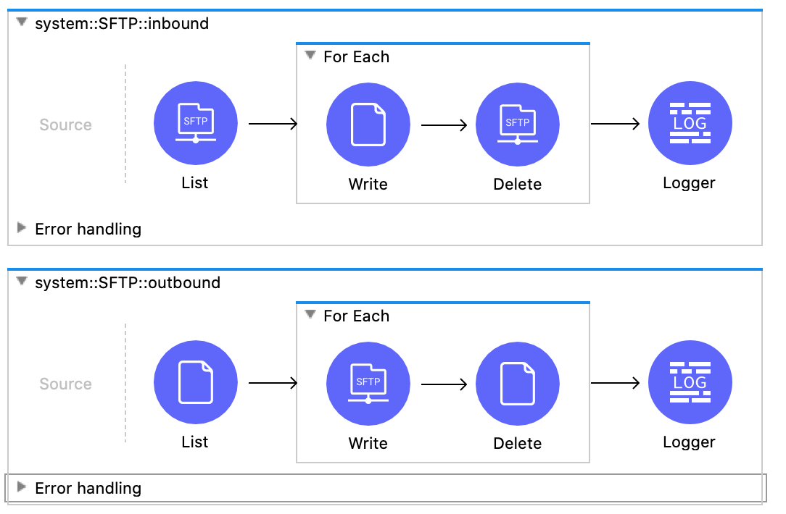
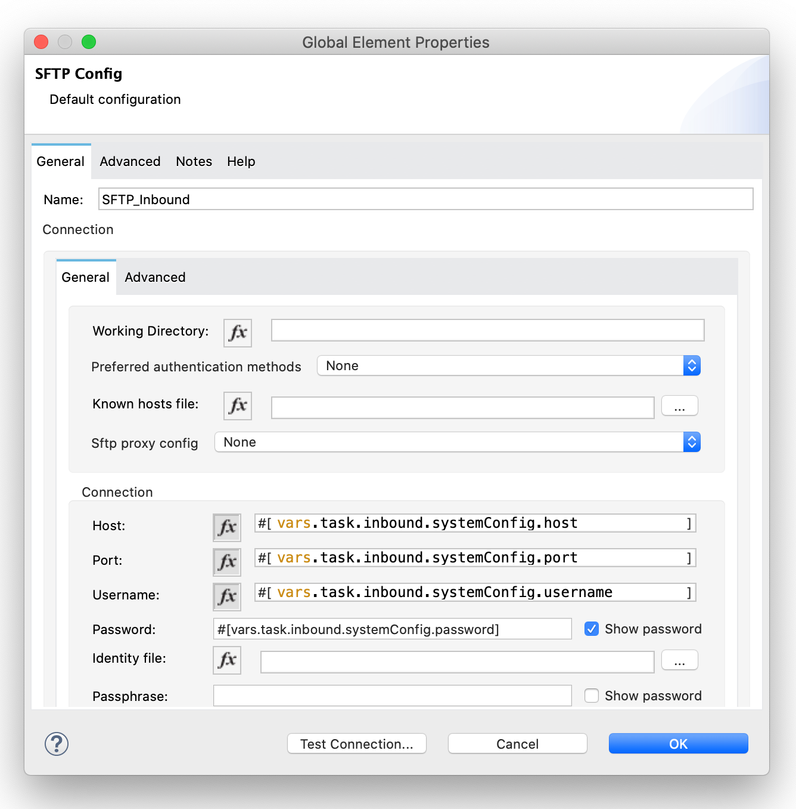

An extremely common pattern today involves managed file transfers. The scenario might involve a large number of SFTP servers that files must be downloaded / uploaded to either on a schedule, or near-real-time as the files are created.

Let's consider a managed file transfer architecture like this:

With this approach, we now have a configurable file transfer agent (the MFT Task Processor) which utilizes an API for configuration; this flexible approach allows us to quickly build a process layer that we can control without touching code.

The issue? In MuleSoft, when building applications, we typically have a single, static (possibly parametrized) connector configuration. A basic flow to download files from an SFTP server, and then upload any pending files to the same server, might look like this:

So how do we go about iterating through our configuration and connecting to each SFTP server when the connector configuration needs to be a global element? Exactly the same way we pass any kind of parameters to MuleSoft! In the background, the connector has a configuration manager which will check if the connection already exists, and if it doesn't, will create it. This allows us to setup our flow like so:

And use a connector configuration setup with the current scope's variables rather than static parameters:

Now each time we iterate through our configuration and call an SFTP operation, the connection will be created if it doesn't already exist! This trick isn't limited to the SFTP connector either; this will work for the vast majority of connectors. 

### This method won't work with event sources (ie: connectors that go in the Source section of a flow); for that you would need to use flow templates and some code to dynamically create new flows.

For a reference solution __(note: NOT for production use as-is)__, take a look at these repositories:
* https://github.com/mikeacjones/mft_config-sapi
* https://github.com/mikeacjones/mft_job-papi
* https://github.com/mikeacjones/mft_task-processor

# Wrap Up

If you have any questions or issues, feel free to click the button at the [top of the page](#) and submit a `post question`!
