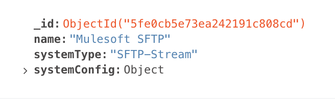
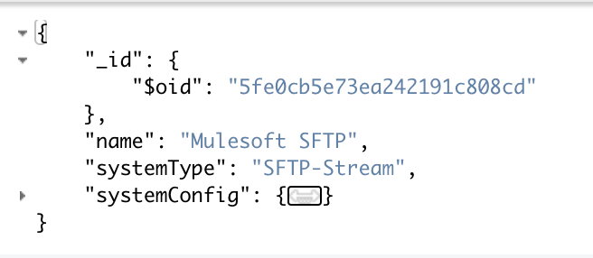

All of the examples below are were tested against a free-tier MongoDB hosted on Atlas.

## Table of Contents:

1. [The Basics](#the-basics)
   1. [MQL to DataWeave](#mql-to-dataweave)
   2. [MQL Objects](#mql-objects)
2. [Advanced Operations](#advanced-operations)
   1. [Aggregation Pipelines](#aggregation-pipelines)
3. [Wrap Up](#wrap-up)

# The Basics

## MQL to DataWeave

In MQL, we frequently see operations like this:

```MQL
db.inventory.find( { status: { $in: [ "A", "D" ] } } )
```

Which, in SQL, is equivalent to

```SQL
SELECT * FROM inventory WHERE status IN ("A", "B")
```

In the query above, the `$in` operator is a special MongoDB operation. When we run this query in the Mulesoft connector, we pass the query in as JSON, with the `$in` operator as a key:

```JSON
{
  "status": {
    "$in": [
      "A",
      "B"
    ]
  }
}
```

If we wanted to run this same query in the MongoDB connector, we would use the `Find documents` operation with the following dataweave as our Query:

```data-weave
output application/json
---
{
  status: {
    "\$in": [
      "A",
      "B"
    ]
  }
}
```

The `$` is a special character in dataweave which means we need to escape it, but that is all there is to it!

## MQL Objects

The same principle exists for specifics objects, such as the `ObjectId`. For example, if we wanted to query for a specific document structured like this:



We can run this dataweave:

```data-weave
output application/json
---
{
  "_id": {
    "\$oid": "5fe0cb5e73ea242191c808cd"
  }
}
```

If you're wondering how I know to use `$oid`, I cheated a bit! The easiest means of working with your MongoDB and building queries / aggregations is to use [MongoDB Compass](https://www.mongodb.com/products/compass). Compass is a free UI you can use to browse the data. In our example above, I can use Compass to convert the structure to its JSON representation (which is what we're passing to the Connector), which shows me this:



# Advanced Operations

## Aggregation Pipelines

Say we wanted to utilize [MongoDB Atlas Search](https://www.mongodb.com/atlas/search), which provides an easy way to search content in your collection. In this case, we have to use the `$search` pipeline provided by Atlas, which looks like:

```mql
{
  $search: {
    <operator>: {
      <specification(s)>
    }
  }
}
```

For example, I built an API with Mulesoft which is leveraged by the Ink Bot running on r/pen_swap; [you can play with the API here](https://anypoint.mulesoft.com/exchange/portals/mulesoft-6908/13024f4f-f380-436f-9c65-6b35a849d17e/system-inks/minor/1.0/pages/home/). This bot allows users to leave a comment with a list of ink names, and the bot responds with a corresponding list of image links. The one thing you can count on is that no two users will type the name the same way, and that people will regularly have typos! Enter Atlas Search. In MQL, my query looks like this:

```mql
$search: {
  "phrase": {
    "query": "USER INPUT HERE",
    "path": ["fullName", "alternateNames"],
    "slop": 3
  }
}
```

When running this search, I want to also filter out any inks missing `approved: true`, and only return one item. Building a pipeline in this in MQL is fairly simple, and looks like:

```mql
db.inks.aggregate([
  {
    $search: {
      "phrase": {
        "query": "USER INPUT HERE",
        "path": ["fullName", "alternateNames"],
        "slop": 3
      }
    }
  },
  { $match: { "approved": true } },
  { $limit: 1 }
])
```

This gives me exactly what I need in Compass; to translate this to the Mulesoft connector we make use of the `Execute command` operation which allows us to run anything which might not have an operation wrapper. When using the operation `Execute command` we can't specify our collection, which we need to do (ie: `db.inks.aggregate(..)`). To make this work, you take the command you are running (in this case `aggregate`) and pass it in with a collection name like so:

```data-weave
output application/json
---
{
  "aggregate": "COLLECTION NAME"
}
```

Next, the aggregation command takes a `pipeline`, and array of operations, as its input. So this becomes:

```data-weave
output application/json
---
{
  "aggregate": "COLLECTION NAME",
  "pipeline": []
}
```

And finally you have to provide an empty cursor object which will be populated with the documents produced by the final stage of the aggregation:

```data-weave
output application/json
---
{
  "aggregate": "COLLECTION NAME",
  "pipeline": [],
  "cursor": {}
}
```

The rest is just like everything we've done before; we just stick our commands in the pipeline:

```data-weave
output application/json
---
{
  "aggregate": "inks",
  "pipeline": [
    {
      "\$search": {
          "phrase": {
          "query": payload,
          "path": ["fullName", "alternateNames"],
          "slop": 3
        }
      }
    },
    {
      "\$match": {
        "approved": true
      }
    },
    {
      "\$limit": 1
    }
  ],
  "cursor": {}
}
```

As an example, if I run the query above with "KWZ Turquoise" set as my payload, the JSON returned would be:

```json
{
  "cursor": {
    "firstBatch": [
      {
        "_id": {
          "$oid": "5ed6662b605762cc64fcb7b6"
        },
        "approved": true,
        "fullName": "KWZ Ink Iron Gall Turquoise",
        "primaryImage": "https://dl.airtable.com/qF2Z7CX3SHWbuzLS6FPn_KWZ%20Ink%20Iron%20Gall%20Turquoise.jpg"
      }
    ],
    "id": 0,
    "ns": "inky_bot.inks"
  },
  "ok": 1.0,
  "$clusterTime": {
    "clusterTime": {
      "$timestamp": {
        "t": 1609449675,
        "i": 1
      }
    },
    "signature": {
      "hash": {
        "$binary": {
          "base64": "zlahFiTYP4mv/4WzJkgiM0Xjbjo=",
          "subType": "00"
        }
      },
      "keyId": 6867134372470849538
    }
  },
  "operationTime": {
    "$timestamp": {
      "t": 1609449675,
      "i": 1
    }
  }
}
```

From here I can now make use of my cursor in order to extract the objects that I need!

# Wrap Up

As you can see, we should be able to run any command / pipeline against MongoDB with the Mulesoft connector, we just have to translate them to an appropriate JSON payload using DataWeave! If you have any questions or issues, feel free to click the button at the [top of the page](#) and submit a `post question`!
