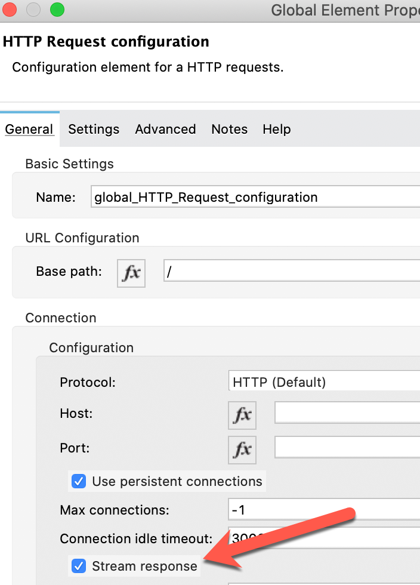
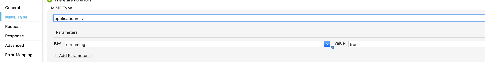
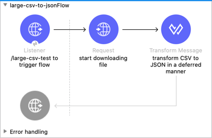

Before we start talking about streaming and deferred dataweave, lets consider a traditional batch approach. In this example, we will be considering a process which downloads a large CSV (GB size range), transforms the data to JSON, and then upserts this information into Salesforce. The step by step process for that probably looks like this:

1. Download file from SFTP to local file system
2. After downloading file, open file and start reading line by line and building an in-memory JSON object structure
3. Write in-memory object structure to JSON file
4. Using batch API, upload  JSON file to Salesforce for upsert

There are a lot of inefficiencies with this approach! The first and biggest is that we are waiting until we've finished downloading the file to even start working on it. Given the potential size of these files, that can translate to a lot of wasted time! The next issue is that typically we try and transform the entire file in a single go, which can cause quite a few issues around memory - writing this data to file after transforming it in-memory is also inefficient because I/O operations tend to be slow, and depending on the size of the file and the environment that we are working in (such as CloudHub) we might potentially be running into issues around disk space.

Let's talk about a better way..

## What is Streaming?

Streaming, at least in this context, is the idea that when we download a file, receive data from an HTTP endpoint, etc, the data comes in as a stream of data; we don't just receive everything in a single huge chunk! In a traditional approach, we wait until we've received all of the data before we start working on it; with a streaming approach, we work on the data as we receive the bytes, which are stored in a working buffer. MuleSoft makes working with streams easy and, typically, seamless.

## What is Deferred Dataweave?

From the documentation:

> DataWeave processes streamed data as its bytes arrive instead of scanning the entire document to index it. When in deferred mode, DataWeave can also pass streamed output data directly to a message processor without saving it to the disk. This behavior enables DataWeave and Mule to process data faster and consume fewer resources than the default processes for reading and writing data.

It is pretty straightforward to understand what this means: we can stream everything from input to output! This allows us to transform the data from our SFTP file __as it arrives__ rather than waiting for the entire file; whether this data is CSV, JSON, or XML, DataWeave will handle aggregating the chunks of data received into appropriate data structures which we can work on.

# Let's Build an Example Project

Personally, I've always found building a working example to be the best way to illustrate a point. To keep things simple, we're going to build a basic application which will download a very large CSV file provided by the CDC on COVID-19 cases, transform the data structure to JSON, and stream the response back to our HTTP Listener. This means that, without ever writing the file to disk, we will be able to watch in our browser/postman/curl command as the CSV file is downloaded and transformed!

## Overview

We will be downloading a 1.59GB CSV file with a structure like this:

```csv
cdc_case_earliest_dt ,cdc_report_dt,pos_spec_dt,onset_dt,current_status,sex,age_group,race_ethnicity_combined,hosp_yn,icu_yn,death_yn,medcond_yn
2020/03/23,2020/03/31,2020/03/23,,Laboratory-confirmed case,Female,0 - 9 Years,"Black, Non-Hispanic",Unknown,Unknown,Unknown,Unknown
```

And converting it to a JSON structure like this:

```json
[
  {
    "earliestDt": "2020/03/23",
    "reportDt": "2020/03/31",
    "spectDt": "2020/03/23",
    "onsetDt": null,
    "status": "Confirmed",
    "patient": {
      "sex": "Female",
      "ageGroup": "0 - 9 Years",
      "raceEthnicity": "Black, Non-Hispanic",
      "hospYn": "Unknown",
      "icuYn": "Unknown",
      "deathYn": "Unknown",
      "medCondYn": "Unknown"
    }
  }
]
```

### Building the Application

1. Open up Anypoint Studio and create a new application called `large-csv-to-json`
2. Add an HTTP Listener to the palette and create a default configuration. Set the endpoint to `/large-csv-test`
2. We're going to use a REST Request in order to download this file:
   1. Drag a REST Request onto the palette 
   2. Now, in order to tell the Request that we want to treat the response as a stream, create a new Request configuration and check the box that says "Stream response"
   
   2. Paste the URL to the file into the REST request component, and make sure the request is set as a GET operation.
      - URL: `http://large-csv-file.us-e2.cloudhub.io/CovidData.csv`
   3. Finally, we need to tell dataweave that the input should be worked on as a stream. If we don't, dataweave will write the content to disk for any file that is over 1.5MB. We do this by setting the mime type on the request to `application/csv; streaming=true`. While the process will work without this piece, it will be considerably slower due to disk I/O operations.
   
3. After the Request operation, add a Transform component and paste the following dataweave. By adding `deferred=true`, we tell the script to pass an output stream directly to the next message processor in the flow.

```data-weave
%dw 2.0
output application/json deferred=true
---
payload map {
    "earliestDt": $.cdc_case_earliest_dt,
    "reportDt": $.cdc_report_dt,
    "spectDt": $.pos_spec_dt,
    "onsetDt": $.onset_dt,
    "status": $.current_status,
    "patient": {
      "sex": $.sex,
      "ageGroup": $.age_group,
      "raceEthnicity": $.race_ethnicity_combined,
      "hospYn": $.hosp_yn,
      "icuYn": $.icu_yn,
      "deathYn": $.death_yn,
      "medCondYn": $.medcond_yn
    }
  }
```

That's it; we now have a flow that will initiate downloading the CSV file, and as the file is downloaded, it will transform the output to JSON and stream the response back to the application that made the request. Your flow should now look like this:



Go ahead and run the application, and either browse to `http://localhost:8081/large-csv-test` or run the following CURL command:

```bash
curl http://localhost:8081/large-csv-test
```

You should see something like this:


As you can see, even though the 1.59GB file is still downloading, we are already seeing results from the transform.


# Wrap Up

Using a streaming strategy, both for your actual data and the processing of that data, is a very powerful tool that provides substantial time and memory gains. By downloading, transforming, and returning our results concurrently, we create a very fast process for handling very large files with millions of records. If you have any questions or ran into any issues implementing this, please use the link at the top of the page to reach out!

To download a complete working example of this project: https://github.com/mikeacjones/large-csv-to-json-stream-example
