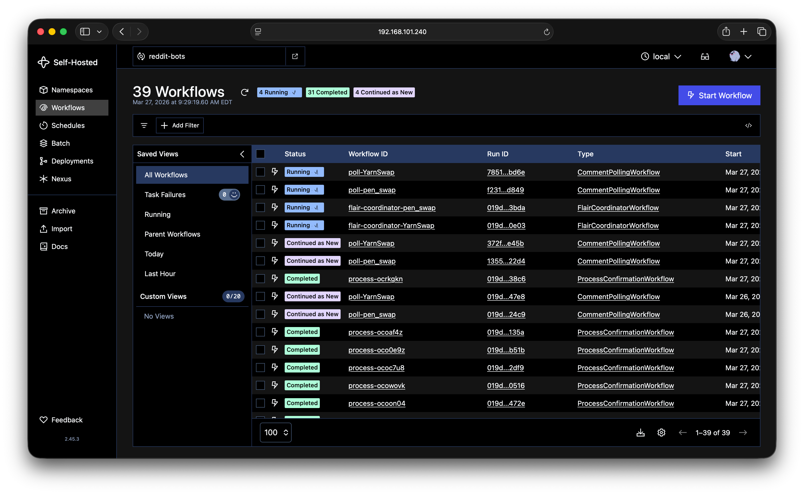
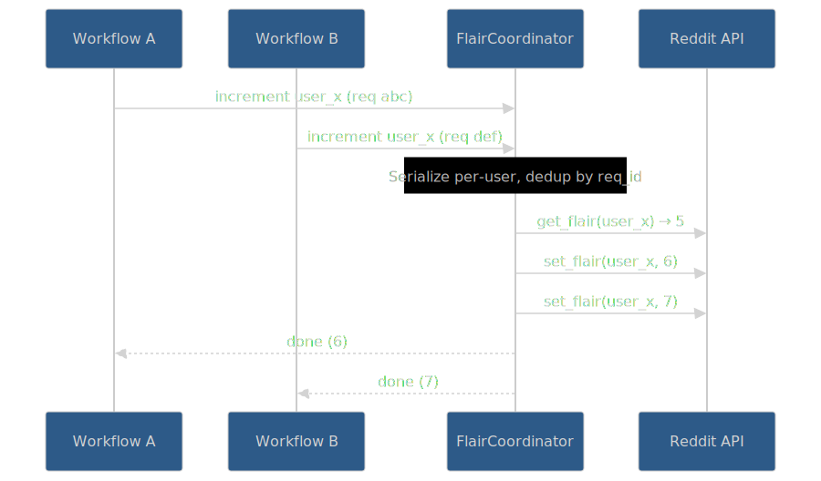

Yeah.. it's been a minute. Life, work, the usual suspects. But I recently ported my Reddit bot to Temporal,and I think the journey is worth sharing; especially if you've ever tried to keep a long-running process alive and *correct* in the real world.

Let's talk about building a Reddit bot that tracks trade confirmations, the many ways it broke, and how [Temporal](https://temporal.io) finally made it dependable.

---

# What Does the Bot Do?

I moderate the bot for few trade subreddits; communities like r/pen_swap and r/YarnSwap where users buy, sell, and trade with each other. Reputation matters a lot in these communities, and users want to know they're dealing with someone trustworthy. The way this works:

1. The bot creates a **monthly confirmation thread** (pinned to the top of the subreddit)
2. **User A** posts something like "Traded with u/UserB"
3. **User B** replies with "Confirmed"
4. The bot **validates** the confirmation (not self-confirming, not a duplicate, mentions are correct, etc)
5. The bot **increments both users' flair** with their updated trade counts
6. The bot **replies** with the new counts

Sounds straightforward, right? It really isn't. The bot has to run 24/7, never miss a single confirmation, and never double-count a trade. If someone has 50 confirmed trades, that number needs to be accurate.

---

# Phase 1: The Naive Script

The first version was about what you'd expect: a single `bot.py`, roughly 450 lines, deployed on an EC2 instance.



The core of it was PRAW's `stream.comments()`, a blocking generator that yields new comments as they appear:

```python
import praw

reddit = praw.Reddit(...)
subreddit = reddit.subreddit("pen_swap")

for comment in subreddit.stream.comments():
    if is_confirmation(comment):
        validate_and_process(comment)
```

Simple! And it worked great... as long as nothing ever went wrong.

The processing logic was similarly straightforward:

```python
def increment_flair(subreddit, user):
    current_flair = next(subreddit.flair(user))
    current_count = parse_count(current_flair)
    new_count = current_count + 1
    subreddit.flair.set(user, flair_text=format_flair(new_count))

def process_confirmation(comment):
    parent = comment.parent()
    user_a = parent.author
    user_b = comment.author

    increment_flair(subreddit, user_a)
    increment_flair(subreddit, user_b)
    comment.save()  # mark as processed
    comment.reply(f"Trade confirmed! ...")
```

---

# Everything That Went Wrong



Let me walk through the fun ways this broke in the real world..

## Reddit API Outages

Reddit's API goes down. Regularly. When it does, PRAW's `stream.comments()` doesn't always fail cleanly. Sometimes the internal listing generator just... stops yielding items. Silently. The bot looks like it's running, but it's processing nothing.

Even worse, PRAW lazy-loads Reddit objects. When you access `comment.author`, it doesn't have that data yet; it makes an API call right then. So you can get a comment object just fine, start processing it, and then have it blow up mid-operation when it tries to fetch the parent comment's author during an API blip. This is before you even consider the steps where we do things like set the flair count.

## The Double-Increment Problem

Remember that `process_confirmation` function? Here's what happens when the bot crashes after incrementing flair but *before* calling `comment.save()`:

1. Bot reads User A's flair: **5**
2. Bot sets User A's flair to **6** ✅
3. Bot reads User B's flair: **10**
4. **💥 Bot / confirmation function crashes ** (Reddit API outage, process killed, whatever)
5. Bot restarts, sees the comment isn't saved, reprocesses it
6. Bot reads User A's flair: **6** (already incremented!)
7. Bot sets User A's flair to **7** ❌ Double count!

The root issue: `increment_flair` is **not idempotent**, and the "I processed this" marker (`comment.save()`) happens *after* the state mutation. The only real solution to this would be to roll my own state machine, and who wants to do that for a hobby project?

---

# Phase 2: My Homegrown Durability Layer

After getting burned enough times, I built [praw-bot-wrapper](https://github.com/mikeacjones/praw-bot-wrapper); a custom library that wraps PRAW's streams with error recovery:



```python
from praw_bot_wrapper import Bot

bot = Bot(reddit)

@bot.stream_handler(bot.subreddit(SUBREDDIT_NAME).stream.comments)
def handle_comment(comment):
    if is_confirmation(comment):
        process_confirmation(comment)

@bot.outage_recovery_handler(outage_threshold=10)
def on_recovery(error_count):
    notify_mods("Bot recovered from outage")

bot.run()  # infinite loop with error recovery
```

Under the hood, it wrapped everything in a `while True` loop that caught PRAW exceptions, reset the stream generators, applied exponential backoff, and used a `BoundedSet(301)` for deduplication separate from PRAW. When the error count exceeded a threshold and then recovered, it fired notification handlers.

It did what I needed: **keep the bot alive through Reddit API blips**. Roughly **42% of my codebase** was now error handling and durability logic rather than actual confirmation logic.. this kind of sucks. And it *still* didn't solve the hard problems:

| Problem | Fixed? |
|---------|--------|
| Survives API blips | ✅ Yes |
| Dedup on restart | ❌ No, `BoundedSet` is in-memory |
| Persistent checkpoint | ❌ No |
| Multi-step retry | ❌ No |
| Zero-downtime deploy | ❌ No |
| Double-increment safe | ❌ No |

The wrapper kept the bot alive, but it couldn't make it **correct**. A crash at the wrong moment still meant double-counted trades or missed confirmations. The 301-item dedup window was a ticking time bomb; a long enough Reddit outage and the window slides past unprocessed items.

I was spending most of time / code building for reliability rather than building the actual bot logic. I wanted to add features like a local LLM to handle when a user didn't reply exactly `confirmed`, and a detection mechanism for suspicious activity; for example, At one point I added a look-back flow which checked that the users actually posted a WTB/WTS post and interacted. But keeping things running and reliable with these extra pieces proved to not be worth the effort, so I dropped them.

---

# Phase 3: Enter Temporal

I'd heared about [Temporal](https://temporal.io). Durable execution, automatic retries, workflow state that survives crashes. It sounded almost too good to be true, but I was tired of fighting the durability problem myself, so I decided to give it a shot.

**Fair warning:** this was my first Temporal project. In point of fact, this was my "lets learn about Temporal" for my interview project 😎 I'm still learning the patterns, still figuring out the best way to structure things. What I'm sharing here is what worked for me, not necessarily best practices. But even as a beginner, the difference is dramatic.

I replaced my bot with a set of **durable workflows**:



| Workflow | What It Does |
|----------|-------------|
| `CommentPollingWorkflow` | Long-running workflow that polls for new comments. Uses continue-as-new to avoid unbounded event history. |
| `ProcessConfirmationWorkflow` | One per confirmation. The comment ID *is* the workflow ID, making it physically impossible to process the same comment twice. |
| `FlairCoordinatorWorkflow` | A singleton that serializes all flair updates. More on this below; it was the key insight. |
| `MonthlyPostWorkflow` | Creates the monthly confirmation thread. Just a Temporal schedule now, no crontab. |
| `LockSubmissionsWorkflow` | Locks old threads. Also a schedule. |

Here's what the polling workflow looks like in practice:

```python
@workflow.defn
class CommentPollingWorkflow:
    @workflow.run
    async def run(self, state: PollingState) -> None:
        while True:
            # Fetch new comments (this is an activity, automatically retried)
            result = await workflow.execute_activity(
                fetch_new_comments,
                state.seen_ids,
                start_to_close_timeout=timedelta(minutes=2),
                retry_policy=REDDIT_RETRY_POLICY,
            )

            # Start a child workflow for each confirmed comment
            for comment in result.confirmed_comments:
                await workflow.execute_activity(
                    start_confirmation_workflow,
                    comment,
                )

            state.seen_ids = result.updated_seen_ids

            # Continue-as-new when Temporal suggests it
            if workflow.info().is_continue_as_new_suggested():
                workflow.continue_as_new(state)

            await asyncio.sleep(state.poll_delay)
```

And the confirmation processing:

```python
@workflow.defn
class ProcessConfirmationWorkflow:
    @workflow.run
    async def run(self, comment_data: CommentData) -> dict:
        # Validate the confirmation
        validation = await workflow.execute_activity(
            validate_confirmation,
            comment_data,
            start_to_close_timeout=timedelta(seconds=30),
            retry_policy=REDDIT_RETRY_POLICY,
        )

        if not validation.is_valid:
            return {"status": "rejected", "reason": validation.reason}

        # Request flair increment via the coordinator
        result_a = await workflow.execute_activity(
            request_flair_increment,
            FlairIncrementRequest(user=comment_data.parent_author, ...),
        )
        result_b = await workflow.execute_activity(
            request_flair_increment,
            FlairIncrementRequest(user=comment_data.author, ...),
        )

        # Reply to the comment
        await workflow.execute_activity(
            reply_to_comment, comment_data, result_a, result_b,
        )

        return {"status": "confirmed"}
```

The key thing to notice: each step is an **activity** with its own retry policy. If the Reddit API fails during `validate_confirmation`, Temporal retries it automatically. If the worker crashes between `request_flair_increment` and `reply_to_comment`, the workflow picks up *exactly where it left off* when the worker comes back. No lost state.

And because each confirmation workflow is started with the comment ID as the workflow ID, Temporal enforces uniqueness at the platform level. Even if the poller sends the same comment twice, the second attempt is rejected. **Idempotency for free.**

Also suuuuper cool? When a bug happens because of those weird API semantics in Reddit (no seriously, the documentation is useless), I can just replay the event locally while debugging and see where my code went wrong.

## What Temporal Gave Me Immediately

- **Durability:** worker crashes? Workflow resumes exactly where it was - because of the way event replay works, my in-memory state even gets rebuilt. No more thinking about the need for external state persistence.
- **Idempotency:** comment ID as workflow ID means no double processing.
- **Visibility:** the Temporal UI shows every workflow, every activity attempt, every failure. No more guessing what happened at 3 AM. The ability to replay a confirmation flow with that data that caused the failure? Priceless.
- **Scheduling:** monthly post creation and thread locking are just Temporal schedules. Deleted the crontab.



That screenshot is the actual bot running. You can see the polling workflows running, flair coordinators active, and individual confirmations completing. All visible at a glance.

---

# The Hardest Bug: Flair Double-Increment

This bug plagued me through both Phase 1 and Phase 2. The core issue: `increment_flair` reads the current count, adds 1, and writes it back. If anything goes wrong and the operation retries, it reads the *already-incremented* value and increments again.



The solution was the **FlairCoordinatorWorkflow**, a durable singleton that serializes all flair updates. It uses Temporal's `update` mechanism so that confirmation workflows can request flair increments and wait for the result.

```python
@workflow.defn
class FlairCoordinatorWorkflow:
    def __init__(self):
        self._results: dict[str, FlairIncrementResult] = {}
        self._flair_cache: OrderedDict[str, int] = OrderedDict()
        self._users_in_progress: set[str] = set()

    @workflow.update
    async def increment_flair(self, request: FlairIncrementRequest) -> FlairIncrementResult:
        # Dedup by request ID; if we've seen this request, return cached result
        if request.request_id in self._results:
            return self._results[request.request_id]

        # Serialize per user; wait if this user is already being updated
        while request.username in self._users_in_progress:
            await workflow.wait_condition(
                lambda: request.username not in self._users_in_progress
            )

        self._users_in_progress.add(request.username)
        try:
            # Use cached count if available (Reddit's API is eventually consistent)
            current = self._flair_cache.get(request.username)
            if current is None:
                current = await workflow.execute_activity(
                    get_user_flair, request.username, ...
                )

            new_count = current + 1
            await workflow.execute_activity(
                set_user_flair, request.username, new_count, ...
            )

            self._flair_cache[request.username] = new_count
            result = FlairIncrementResult(new_count=new_count)
            self._results[request.request_id] = result
            return result
        finally:
            self._users_in_progress.discard(request.username)
```

Three layers of protection:

1. **Request-ID deduplication:** each increment request has a unique ID. If the coordinator sees the same ID again (due to a retry), it returns the cached result. This cached result is purely in-memory, and even if the worker crashes, is automatically rebuilt during replay (you know.. I think I get why Temporal calls their conference Replay! 🧐)
2. **Per-user serialization:** two simultaneous confirmations for the same user? The second one waits until the first finishes. No race conditions - which, by the way, I had never actually experienced before swapping to Temporal because my previous process was just so much slower. Read below...
3. **LRU cache over stale reads:** Reddit's flair API is eventually consistent. If you read a flair right after writing it, you might get the old value. The coordinator maintains its own cache of last-known counts, so it doesn't need to trust Reddit's reads.

This is the kind of problem that Temporal makes *solvable*. You need a durable singleton with in-memory state that survives restarts, serialized access per entity, and request-level deduplication. Try building that with just try/except and a BoundedSet.

---

# Deploying with Rainbow Deployments

The final piece of the puzzle: deployments. In the old world, deploying a code change meant restarting the bot, which meant losing all in-flight state. With Temporal's worker versioning and the [Temporal Worker Controller](https://github.com/temporalio/temporal-worker-controller) on k3s, I now have zero-downtime deployments:



The flow:

1. Push code to GitHub
2. Self-hosted GitHub Actions runner builds a new Docker image (tagged with the git SHA)
3. Helm upgrade deploys a new `TemporalWorkerDeployment`
4. The Worker Controller routes **new work** to the new version
5. **Old workers finish their in-flight workflows**, so nothing gets dropped
6. Long-running workflows (polling, flair coordinator) detect the version change and `continue_as_new` onto the new version

```python
# In the polling workflow, checks if a new version has been deployed
if workflow.info().is_target_worker_deployment_version_changed():
    workflow.continue_as_new(state)
```

Code change to production in minutes. No manual intervention. No dropped confirmations.

And ok so maybe this isn't true rainbow deployments because I'm not processing at a volume that ever sees more than two deployment slots at a time, but it is just very cool how easy it was to add this, and calling it a rainbow deployment feels fancy. And now I don't have to think about code patching due to non-deterministic changes.


---

# Still Learning

I want to be transparent: **I'm still a Temporal beginner.** This was my "getting started" project, and I'm sure there are patterns I'm not using optimally. A few things I learned the hard way:

- **Continue-as-new is important for long-running workflows.** My first version of the polling workflow didn't use it, and the event history grew unbounded. Now I use `workflow.info().is_continue_as_new_suggested()` to let Temporal tell me when it's time.
- **Split your reads and writes into separate activities.** My original `increment_flair` combined both, which made retries dangerous. Splitting them apart and routing through the coordinator was the key insight. Idemopotence is important y'all!
- **Design for idempotency from the start.** Using the comment ID as the workflow ID was obvious in retrospect, but I didn't think of it immediately. The more you can push uniqueness constraints into Temporal's infrastructure, the less you have to handle yourself.

There's plenty more I want to explore: better observability with Prometheus and Grafana (I've started on this), more sophisticated retry strategies, and potentially adding in some longer running human-in-the-loop flows when the bot flags suspicious activity. But even at this early stage, the difference is night and day.

---

# Wrap Up

Here's the before and after:

| | Before Temporal | After Temporal |
|---|---|---|
| **Architecture** | Single `bot.py` | 5 workflows, 12 activities |
| **Error handling** | ~42% of codebase, didn't work perfectly | ~15%, Temporal handles the rest |
| **Score accuracy** | Double-counts on crash | Guaranteed exactly-once |
| **Missed trades** | After long outages | Never |
| **Deployments** | SSH + restart | Zero-downtime, automated |
| **Recovery** | Manual restart | Automatic |
| **Observability** | Pushover alert on crash | Full workflow visibility |

I spent 2 years building workarounds for problems that Temporal solves out of the box. The homegrown wrapper kept the bot alive, but Temporal made it **correct**. And that's the difference that matters; users on these trade subreddits are trusting the bot with their reputation. "It mostly works" isn't a great approach.

If you're running any kind of long-lived process that needs to survive the real world, like API outages, crashes, deployments, et al; I'd strongly recommend giving Temporal a look. Even as a beginner, the ramp-up was worth it.

The bot's source code is on [GitHub](https://github.com/mikeacjones/reddit-trade-confirmation-bot) if you want to dig into the details.
